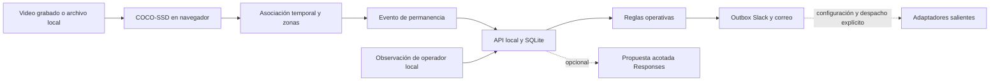

# U01 — Video y casos operativos

## Autorización y base

El 2026-09-12 el usuario priorizó video frente a fotografías, proporcionó una referencia CCTV y pidió iniciar código inmediatamente. Después pidió incorporar los cambios del PVB en Git. Se integró `613ce94` antes de construir; ese commit reafirma Slack y correo como obligatorios para la demostración. No se rebaja ese requisito para declarar completada esta unidad parcial.

Se usa la estructura de trazabilidad de AI-DLC como registro de trabajo; no se declara haber instalado un motor ni superado gates formales que no ocurrieron. El PRD global sigue en revisión. La construcción acotada se apoya en esta instrucción posterior del usuario.

## Diseño y contratos

Vite sirve una interfaz sin framework. Se separan tres responsabilidades: `vision.js` congela un cuadro antes de inferir; `tracker.js` asocia detecciones y mide usando tiempo del video; `server/` conserva casos, versiones y operaciones. No se transmiten píxeles a OpenAI. Sus propuestas opcionales están limitadas a la intención permitida por el estado; el incremento básico utiliza reglas, sin fingir un agente adaptativo completo.

Cada visita tiene `run_id` y `visit_id`. Cambiar fuente, zonas o umbral, o buscar otra posición, reinicia la medición. Pausar no suma tiempo; un cuadro no observado interrumpe la acumulación aunque se conserve brevemente el ID. La asociación geométrica puede fallar con oclusiones y cruces.

Los eventos preservan fuente, zona, tiempo, duración, score, detector, polígono y umbral aplicado. `event_id` repetido con contenido diferente es un conflicto. Las observaciones locales usan `request_id` estable durante un reintento y `expected_version`; una nueva observación puede repetir texto sin confundirse con un duplicado.

Stock e incidencia en estante son condiciones distintas. `stock_confirmed` y `no_stock` requieren `shelf_issue_confirmed=true` además de nota; no se derivan del video. Solo una tarea asignada permite confirmar reposición. Descarte y cierre son estados distintos. La ejecución reportada por operador se registra como humana local, sin afirmar recepción externa o verificación visual.

## Trazabilidad del incremento

| Requisitos | Implementación parcial y aceptación pendiente |
|---|---|
| FR-01/02/03/04 | Referencia identificada, zonas configurables, detección y permanencia temporal. Falta evaluación anotada reservada. |
| FR-06/07/09 | Inventario fixture, reglas, confirmación de incidencia y facultades acotadas. Falta directorio real y autonomía contextual completa. |
| FR-08/17 | Outbox y adaptadores salientes; no hay recepción real, seguimiento ni despacho autónomo. No aceptados. |
| FR-10/11/12 | Idempotencia, persistencia, control de versión, cierre humano tipificado y resultados de envío inciertos. Falta reconciliación con proveedores reales. |
| FR-16 | Exportación de registros JSON y configuración por evento; no exporta un clip de evidencia ni valida calidad visual. |
| NFR-06/07/09 | Pruebas de recuperación/errores, controles etiquetados, loopback, claves fuera del cliente. No sustituye auditoría de producción o accesibilidad. |

## Validación

`npm test`: 38 pruebas aprobadas en Node 26 sobre seguimiento, carreras de inferencia, transiciones, persistencia, idempotencia, versiones, errores de canales e integración del pipeline. Las cajas de pruebas son fixtures explícitos; no son resultados de COCO-SSD ni un benchmark de exactitud. Los adaptadores se prueban con transporte sustituido, sin envíos reales.

`npm run build`: construcción Vite correcta. La interfaz y el modelo se verifican adicionalmente en Chrome contra la referencia pública; las observaciones manuales finales se registran en la auditoría.

## U02 pendiente

Preparar cuentas de prueba y destinatarios; implementar entrada correlacionada Slack/correo, identidad, aclaraciones, despacho y seguimiento autónomo por política, reconciliación y pausa operacional. Probar que una respuesta real en cada canal modifica el caso y que ambos reportes llegan. Solo entonces evaluar FR-08/17 y la aceptación D0 completa.
