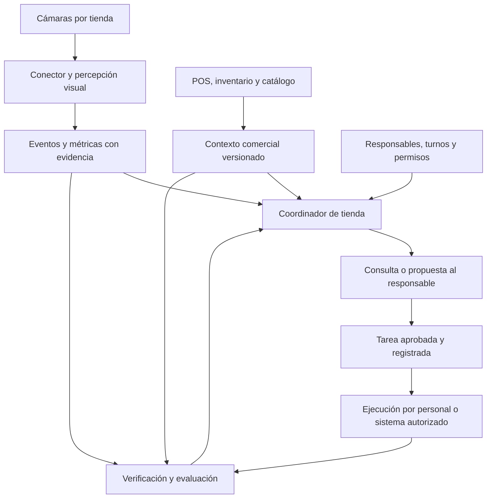

# PanelaTeam — PVB de operación para tiendas de abarrotes

Versión 0.1 · 12 de septiembre de 2026 · Documento de diseño para discusión del equipo.

Repositorio del equipo: [SMarinC/Hackaton-open](https://github.com/SMarinC/Hackaton-open).

Documento completo de diseño del PVB v0.1. Para una lectura breve, consultar el [resumen del PVB](PVB.md).

Continuación: [PRD completo](../specs/prd.md), con requisitos e historias en borrador siguiendo HardcoreAI y la adaptación documental de AI-DLC del curso. PVB corresponde a Product Vision Board; este documento desarrolla su visión operativa.

## 1. Decisiones confirmadas y estado

El usuario confirmó el equipo **PanelaTeam**, el segmento **tiendas de abarrotes con secciones diferenciadas** y el uso de **imágenes y videos de internet para la demo**. Pidió profundizar la visión hacia un PVB: conectar cámaras por tienda, estructurar información y coordinar agentes que consulten personas, soliciten stock o cambios de exhibición y evalúen permanencia, ventas, elección de productos y promociones.

Este documento desarrolla la propuesta inicial «Sistema de análisis visual para optimización de negocios» hacia la operación de tiendas de abarrotes.

La selección de reposición como primer ciclo es una **recomendación de alcance**, todavía no una decisión explícita del equipo. No se han confirmado tienda piloto, cámaras compatibles, acceso a ventas/inventario, canal de comunicación, tamaño del equipo ni implementación. Este desarrollo del Product Vision Board propone un alcance inicial para validar utilidad operativa y valor de negocio; no implica que el producto ya esté construido o validado.

## 2. Promesa de producto

**PanelaTeam conecta observaciones del espacio, datos comerciales y responsables de tienda para detectar situaciones que requieren atención, coordinar una acción y verificar su resultado.**

La persona usuaria principal propuesta es el encargado de tienda; reposición y compras participan según el caso. El comprador por validar sería el propietario o responsable de operaciones de una tienda o pequeña cadena.

La hipótesis inicial de valor es reducir el tiempo y el trabajo necesarios para resolver un faltante en exhibición, manteniendo las alertas suficientemente útiles para que el equipo las atienda. El aumento de ventas es un resultado posible que requiere evidencia adicional.

Secciones ilustrativas: bebidas, snacks, despensa y aseo. Cada establecimiento configura sus propias zonas, productos, responsables y horarios.

## 3. Qué sabe cada fuente

| Pregunta | Fuentes necesarias | Salida defendible |
|---|---|---|
| ¿Dónde hay personas? | Cámara con cobertura conocida y zonas configuradas | Conteos de personas visibles por zona y período; cero observado se distingue de zona no observable. |
| ¿Cuánto permanecen? | Video continuo, tiempos y seguimiento temporal | Duración observada por visita a la zona, número de visitas y trayectorias incompletas. No confundir presencia con interés. |
| ¿Qué sección recibe más visitas? | Cruces de zonas con seguimiento y tiempo observable | Entradas observadas por hora; una persona que regresa puede generar otra visita. No declarar personas únicas entre cámaras. |
| ¿Qué sección vende más? | Punto de venta (POS), catálogo y asociación producto-sección vigente | Rankings separados de unidades netas, ventas netas y margen bruto. Si un producto se exhibe en varias zonas, el ticket no identifica por sí solo su origen físico. |
| ¿Qué producto escogen? | POS para compra; visión específica para retirada y devolución al estante | Producto más comprado por unidades netas. Las interacciones visuales son eventos distintos y requieren identificación de producto y validación. |
| ¿Hay que reponer? | Imagen del estante, distribución esperada de productos, inventario y confirmación cuando sea necesaria | Posible faltante en exhibición, seguido de consulta de existencias y propuesta de reposición. La cámara no determina el inventario total. |
| ¿Qué promoción funciona? | Registro de promoción y ejecución, POS, descuentos, costos, disponibilidad y comparación adecuada | Resultados descriptivos primero; efecto incremental solo con un diseño de evaluación que permita atribución. |

El seguimiento temporal necesita asociar detecciones a lo largo del video; las oclusiones pueden fragmentarlo. [ByteTrack](https://arxiv.org/abs/2110.06864).

Tener existencias físicas, existencias disponibles para vender y mercancía en tránsito son estados diferentes. El modelo del PVB debe respetar los estados del sistema real y su fecha de actualización. Shopify documenta un ejemplo de esa separación; **no se ha elegido Shopify como integración**. [Estados de inventario](https://shopify.dev/docs/apps/build/orders-fulfillment/inventory-management-apps).

## 4. Arquitectura funcional

La conexión de video la resuelve un conector con autenticación y control de salud. La percepción utiliza detección, seguimiento y reglas medibles; los agentes razonan sobre eventos y consultan herramientas cuando falta contexto. El LLM no necesita procesar cada fotograma ni recalcular los totales de ventas.

**Conexión real a cámaras:** comprobar modelo, acceso por cámara o grabador, cobertura, resolución, códec, marcas de tiempo y compatibilidad del flujo. ONVIF Profile T define funciones de transmisión de video; Profile M permite intercambiar determinados metadatos y eventos analíticos entre productos compatibles. Su existencia no prueba que las cámaras de un piloto tengan esas funciones. [Profile T](https://www.onvif.org/profiles/profile-t/) · [Profile M](https://www.onvif.org/profiles/profile-m/).

Procesar cerca de la tienda cuando resulte viable y enviar eventos y evidencia necesaria. Definir retención, acceso por tienda y tratamiento de los fragmentos antes del piloto. Los identificadores de seguimiento serán temporales y locales a la observación; el alcance propuesto no requiere reconocer rostros.

Una cámara general puede ser adecuada para personas y no mostrar suficiente detalle del estante. Reconocer referencias de producto o retiradas puede requerir otro encuadre, datos de entrenamiento o captura específica. Esa capacidad debe comprobarse con material representativo.

## 5. Responsabilidades de los agentes

Son roles funcionales. Pueden comenzar dentro de un solo servicio con herramientas separadas.

| Rol | Responsabilidad | Herramientas o datos | Resultado |
|---|---|---|---|
| Observación de tienda | Detectar cambios observables, revisar cobertura y estructurar evidencia | Video, zonas, modelos visuales, seguimiento y cálculos | Evento con medida, período y limitaciones |
| Análisis comercial | Relacionar eventos con ventas, disponibilidad y promociones | Consultas POS/inventario/catálogo, cálculos deterministas | Hechos comerciales y opciones de gestión |
| Coordinación operativa | Elegir responsable, pedir aclaraciones, proponer y dar seguimiento | Directorio, turnos, políticas, bandeja y gestor de tareas | Caso con conversación y acción registrada |
| Evaluación | Comprobar ejecución y contrastar resultados con el criterio acordado | Evidencia posterior, estados de tareas y métricas comerciales | Cierre sustentado, solicitud de más evidencia o evaluación pendiente |

El agente de coordinación conserva el estado del caso. Los cálculos deterministas verifican fechas, unidades, duplicados y totales. Un mensaje del personal se interpreta como información recibida; no concede permisos nuevos ni sustituye la política de aprobación.

## 6. Primer ciclo propuesto: reposición de exhibición

Escenario ilustrativo; todos sus datos serían ficticios en la demo:

1. Una vista adecuada muestra un posible hueco persistente en la exhibición de bebidas. Se registra evidencia y se asocia el producto solo si puede identificarse de forma fiable.
2. El coordinador consulta la distribución esperada, inventario y responsable de turno. Si el inventario solo ofrece un total por tienda, pregunta si hay unidades en bodega; no deduce esa ubicación.
3. El responsable confirma el faltante y las existencias utilizables. Si la vista es insuficiente, el caso permanece en validación.
4. Si hay mercancía disponible en bodega, se propone una reposición interna con cantidad sustentada en stock confirmado y capacidad del estante.
5. Si no la hay, se consulta si existe una entrega prevista o un reemplazo autorizado. Una eventual compra se prepara como solicitud para compras.
6. Tras aprobación o aplicación de una regla previamente autorizada, una herramienta guarda la tarea y su identificador.
7. El personal realiza la reposición y reporta el resultado. Se comprueba la evidencia posterior disponible.
8. El caso cierra registrando qué verificó el sistema y qué confirmó una persona. Si solo hay declaración humana, el cierre conserva ese tipo de evidencia.

**Mensaje ilustrativo:**

> La exhibición de bebidas presenta un posible faltante en el fragmento adjunto. El inventario registra existencias en la tienda, pero no confirma su ubicación. ¿Puedes comprobar si hay unidades disponibles en bodega para reponer?

La comunicación aporta una pregunta concreta y accionable. El destinatario se obtiene del directorio configurado; una nueva detección actualiza el caso existente, no envía otro aviso.

Estados propuestos:

`detectado → en validación → propuesta → aprobado → asignado → ejecución reportada → verificado`

También existen `descartado`, `bloqueado` y `cancelado`, con motivo. Una tarea persistida, un mensaje entregado y una reposición física son efectos distintos.

## 7. Quién puede actuar

| Acción | Aprobación o política | Ejecutor | Evidencia de cierre |
|---|---|---|---|
| Consultar stock o pedir revisión | Permisos de lectura y comunicaciones definidos para el piloto | Conector o coordinador | Respuesta de herramienta o responsable |
| Reponer desde bodega | Encargado o regla operativa preautorizada | Personal de tienda | Confirmación y, si es viable, evidencia visual posterior |
| Comprar mercancía | Responsable de compras, presupuesto y reglas comerciales | Persona o sistema autorizado | Pedido aceptado y posteriormente recepción |
| Cambiar exhibición o señalización | Encargado/comercial | Personal de tienda | Registro de cambio y evidencia |
| Cambiar precio o activar promoción | Responsable comercial | POS o canal autorizado | Configuración efectiva y transacciones posteriores |

El diseño contempla comunicaciones reales futuras. En esta fase no se han conectado canales, enviado mensajes, modificado stock ni realizado pedidos.

La demo puede usar una bandeja interna donde un integrante represente al encargado. Las conversaciones y tareas deben persistir realmente, aunque ventas e inventario sean fixtures etiquetados.

## 8. Datos mínimos y consistencia

Cada observación conserva: identificador, tienda, cámara, zona, intervalo temporal, versión de zonas/ubicación de productos, tipo de evento, medida y unidad, calidad de observación, evidencia y procedencia. Distinguir video en vivo, reproducción de archivo, datos sintéticos y anotación humana.

Cada caso añade: fuentes consultadas y su fecha, pregunta pendiente, propuesta, responsable, aprobación aplicable, identificador de acción, estado, vencimiento y criterio de verificación.

Controles funcionales esenciales:

- Un caso activo por problema, tienda y producto/zona; los nuevos fotogramas agregan evidencia.
- Una clave estable por acción evita duplicar tareas ante doble clic o reintento.
- Si el resultado de una escritura es desconocido, consultar su estado antes de repetir.
- Revalidar stock y condiciones relevantes cuando cambien entre propuesta y ejecución.
- Si cámara o inventario están desactualizados, informar la limitación y pedir confirmación.
- Separar datos y permisos por tienda; acceder a una tienda no concede acceso a otra.

## 9. Métricas del PVB

| Métrica | Definición de trabajo | Precaución |
|---|---|---|
| Duración de visita observada | Tiempo seguido dentro de la zona por episodio | Reportar número de episodios, completos e incompletos; una mediana de completos no representa necesariamente todas las visitas. |
| Presencia media | Integral aproximada del conteo visible dividida por tiempo observable, ponderando intervalos | No contar interrupciones como zonas vacías; la unidad es personas visibles en promedio. |
| Ventas netas | Ventas registradas menos descuentos y devoluciones según convención acordada | Reconciliar POS, moneda, impuestos, cancelaciones y período; no duplicar descuentos ya aplicados. |
| Margen bruto | Ventas netas menos costo de mercancía vendida bajo convención consistente | Solo calcular con costos disponibles; no llamarlo utilidad neta. |
| Tiempo de resolución | Tiempo entre señal registrada y cierre verificado | Separar detección, respuesta y ejecución; conservar casos abiertos y no comparar únicamente los fáciles. |
| Alertas útiles | Casos revisados confirmados accionables / casos revisados | Muestrear también períodos sin alertas para identificar faltantes omitidos; registrar casos sin resolver. |
| Carga de operación | Tiempo humano de revisión, coordinación y ejecución, más volumen de avisos | Incluir preparación de datos y falsas alarmas al evaluar utilidad. |

No dividir tickets por visitas a una zona y llamarlo conversión individual sin una correspondencia válida. Los rankings por sección física necesitan resolver productos con múltiples exhibiciones.

## 10. Evaluación de promociones y cambios

El agente de evaluación debe registrar la pregunta antes del cambio. Ejemplo: “¿Esta exhibición mejora el margen de la categoría manteniendo disponibilidad?”. Registrar producto/categoría, ubicación, vigencia, precio, descuento, inventario, cambio realmente ejecutado y métrica principal.

Primero se pueden entregar comparaciones descriptivas de ventas, unidades y margen. Para atribuir resultados a la promoción, definir una comparación válida, preferentemente con asignación aleatoria cuando sea viable. En un diseño por tiendas o períodos hay que considerar estacionalidad, agotados, otras promociones y efectos que persisten entre períodos. Un método estadístico no compensa un diseño sin información suficiente.

Evaluar la categoría cuando exista posible sustitución de otros productos: vender más unidades promocionadas no garantiza mayor margen total. Registrar costos de ejecución disponibles. Para un análisis observacional, explicitar supuestos e incertidumbre; no presentar una comparación antes/después como prueba causal. [Investigación sobre impacto causal de intervenciones comerciales](https://research.google/pubs/inferring-causal-impact-using-bayesian-structural-time-series-models/).

Esto es evolución posterior al primer ciclo operativo; una demo con POS ficticio solo demuestra el cálculo y el flujo.

## 11. Separación entre demo, piloto y evolución

| Etapa | Alcance propuesto | Qué demuestra |
|---|---|---|
| Hackathon | Una tienda representada, un video adecuado, zonas configuradas, inventario/POS ficticios y un caso completo | Percepción que se haya implementado, consulta contextual, conversación, persistencia y verificación dentro de la demo |
| Piloto PVB | Una tienda real, una sección o exhibición, fuentes autorizadas y responsables activos | Viabilidad de captura, calidad de señales, adopción y utilidad operativa |
| Evolución | Más secciones/tiendas, conectores reales, evaluaciones de promociones e interacciones de producto validadas | Capacidad de operar a mayor escala y nuevos resultados medidos |

Para el material de internet: conservar enlace, condiciones de reutilización y atribución; elegir cámara fija y continuidad temporal. No mezclar locales distintos como una única serie temporal. Los datos comerciales ficticios no se emparejan con personas del video como si se hubiera observado una compra.

Si el material no permite detectar un faltante de estante, no afirmar esa capacidad en la demo. Se puede demostrar coordinación a partir de una observación humana claramente etiquetada y mantener la detección automática como pendiente.

La prueba de aceptación del recorrido incluye un caso normal, uno con datos insuficientes y uno con reintento. Anotar manualmente un pequeño conjunto de eventos para comprobar errores básicos; no presentar ese conjunto como validación general.

## 12. Validación de negocio y diferenciación

Observar primero cómo una tienda detecta y resuelve hoy un faltante. Contrastar el flujo asistido con su forma actual de trabajar, incluyendo el costo de configurar cámaras, preparar datos, responder preguntas y atender falsas alertas. Acordar de antemano qué mejora operativa justificaría continuar el piloto y quién decide contratar. No fijar promesas de ahorro sin una línea base.

La propuesta compite con soluciones existentes de visión y ejecución. Focal anuncia cámaras de estante y tareas de reposición; Trax/FORM describe análisis visual combinado con gestión de tareas. Estas páginas acreditan oferta publicada, no resultados de PanelaTeam. [Focal](https://focal.systems/shelf-cameras/) · [Trax/FORM](https://traxretail.com/es/).

La hipótesis de diferenciación sería un despliegue acotado y adaptable a tiendas de abarrotes, con coordinación contextual en su canal habitual y resultados verificables. Falta comprobar que sea más fácil, útil o económicamente viable que configurar alternativas existentes. La cantidad de agentes no constituye por sí sola una ventaja.

## 13. Decisiones que siguen abiertas

- Tienda piloto y persona responsable; número de integrantes y tiempo efectivo de construcción.
- Video de demo y visibilidad suficiente para la observación elegida.
- Catálogo, ubicación de productos y separación bodega/exhibición disponibles.
- POS, inventario, forma de acceso y actualización.
- Canal y reglas de comunicación del piloto.
- Aceptación del ciclo de reposición como primer alcance.
- Criterios medidos de éxito del piloto.

El siguiente paso de diseño es elegir el escenario de demostración y redactar sus datos de entrada, respuestas del encargado y criterio de cierre. Antes de programar detección específica, verificar que el video permite observar el fenómeno elegido.
