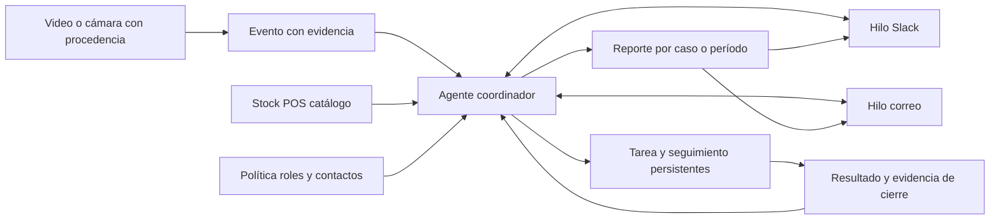

# PanelaTeam — PVB de operación autónoma para abarrotes

**Product Vision Board · v0.2 · 12 de septiembre de 2026 · Borrador de producto para revisión**

**Promesa:** un agente observa situaciones de una tienda, abre gestiones con evidencia y las lleva adelante con sus responsables por Slack y correo: consulta, coordina, recuerda, escala y reporta hasta conocer el resultado.

PanelaTeam es el equipo; nombre comercial pendiente. Esta versión reemplaza la visión operativa vigente de [v0.1](01_PVB_PanelaTeam_Operacion_Abarrotes_v0.1.md), que se conserva como antecedente. El [PRD](../specs/prd.md) mantiene los requisitos verificables; [método](../specs/process.md), [revisión del concurso](research/02_Bases_y_Estrategia_PanelaTeam_v0.2.md) y [misiones para Perplexity](research/03_Perplexity_Misiones_PanelaTeam_v0.2.md) acompañan la decisión. No hay aplicación ni canales conectados todavía.

## Qué cambia y qué está confirmado

Se conservan equipo PanelaTeam, tiendas de abarrotes con secciones diferenciadas y material de internet para la demo. La nueva instrucción exige mayor independencia, interacción externa y reportes al menos por Slack y correo. **El usuario confirmó que aún no hay cuentas de prueba.**

| Aspecto | v0.1 / PRD anterior | Dirección v0.2 |
|---|---|---|
| Papel del agente | Coordinación frecuentemente detenida para aprobación | Inicia, decide y continúa gestiones rutinarias dentro de una política previamente habilitada |
| Entorno de demo | Bandeja interna; canales reales posteriores | Slack y correo reales con participantes de prueba; respuestas alimentan el mismo caso |
| Aprobación | Paso general del recorrido en el PRD | Por excepción cuando la acción lo requiere; la política autoriza el trabajo rutinario |
| Evidencia central | Tarea guardada y cierre | Conversación real que cambia la decisión, efecto persistido, seguimiento y reporte recibido |
| Reportes | Salida secundaria | Resultado automático por caso y resumen por período, con destinatario y datos adecuados |

Reposición sigue como **primer escenario recomendado**, pendiente de selección del equipo. Pedir mayor autonomía no confirma una tienda piloto, acceso a cámaras, stock real, destinatarios, presupuesto o permiso para contactar empresas. En este encargo se define el producto; no se envían comunicaciones.

## 1. Problema

Hipótesis: detectar un problema en exhibición no basta. Alguien debe averiguar si hay mercancía, localizar al responsable, insistir cuando no contesta y comprobar qué ocurrió. Esa coordinación puede fragmentarse entre cámaras, inventario, conversaciones y cambios de turno.

El trabajo que queremos reducir es **perseguir información y conducir cada transición**. El agente se ocupa de ese seguimiento; el personal conserva el trabajo físico y las decisiones fuera de sus facultades. La frecuencia del problema, el tiempo perdido y la voluntad de pagar todavía necesitan validación en una tienda.

La necesidad de coordinar fuentes y personas puede persistir aunque mejoren los modelos. Eso es una hipótesis de durabilidad del flujo, no prueba de ventaja competitiva. No se asigna un Durability Score sin una evaluación acordada.

## 2. Segmento, usuario y comprador

Segmento confirmado: tiendas de abarrotes con secciones distinguibles. Primer piloto propuesto: una tienda con una exhibición observable, encargado identificable, inventario consultable y responsable de reposición disponible. No se conocen tamaño, ingresos, cantidad de locales ni presupuesto del comprador.

| Participante | Valor esperado y responsabilidad |
|---|---|
| Encargado | Atiende excepciones y revisa un resumen de resultados; configura o acepta las reglas de operación |
| Reposición | Recibe una tarea concreta, responde sobre disponibilidad y reporta ejecución o bloqueo |
| Compras / proveedor autorizado | Responde disponibilidad o fecha de entrega; una consulta no constituye un pedido |
| Propietario / operaciones | Decide contratar según reducción de coordinación, costo y utilidad comprobada |
| Administrador | Conecta fuentes, identidades y canales; no obtiene por ello facultades comerciales |

El veto de confianza puede estar en propietario, operaciones o quien autoriza acceso a cámaras/datos. Falta identificarlo. **Slack se elige para la demostración por solicitud del usuario; su adopción habitual por este segmento no está probada.** Correo permite representar relación con un tercero. El piloto deberá adaptarse al canal que efectivamente use la tienda, conservando el mismo caso y reglas.

## 3. Ventaja defendible principal

**Hipótesis elegida: confianza operativa.** Construir un historial verificable de decisiones, comunicaciones, recuperación de fallos y cierres correctos podría permitir delegar tareas con menos supervisión. Hoy no existe esa ventaja: hay una especificación.

La prueba de valor sería que una tienda delegue coordinación rutinaria porque puede revisar qué hizo el agente, por qué, a quién contactó y qué resultado obtuvo. Usar Slack, varios agentes o una API de visión es replicable y no constituye por sí solo una barrera competitiva. Datos de operación futuros dependerán de permisos y calidad; no se presentan como activos ya poseídos.

## 4. Arena competitiva

Posicionamiento propuesto: mejora de un proceso operativo existente mediante integración y agencia. No se afirma crear una categoría inédita ni multiplicar productividad por una cifra no medida. Competimos también con una ronda del encargado, una lista y una conversación que ya funcionan.

Focal y Trax/FORM son referencias de visión y ejecución retail documentadas en el [PVB previo](01_PVB_PanelaTeam_Operacion_Abarrotes_v0.1.md). La diferenciación por validar es una instalación acotada, conversación contextual con responsables y cierre del caso con poco trabajo del supervisor. No se ha demostrado que esas alternativas carezcan de estas capacidades.

La integración con reglas, turnos y evidencia local puede complementar modelos generales. Para contrastarla, comparar el mismo caso con (a) aviso fijo por regla y (b) agente que recibe información nueva y decide la siguiente gestión. Si ambos producen igual resultado con igual esfuerzo, la complejidad agéntica no está justificada.

## 5. Paradigma de experiencia y autonomía

**Paradigma: agente que actúa dentro de facultades configuradas.** No necesita que el encargado abra un chat, redacte cada instrucción o apruebe cada mensaje. Puede recibir eventos, preguntar, interpretar una respuesta, elegir la próxima herramienta, esperar y reanudar. Configuración inicial y atención de excepciones siguen siendo necesarias.

| Acción | Autonomía propuesta |
|---|---|
| Consultar datos autorizados, solicitar confirmación o evidencia | Automática cuando hace falta para resolver el caso |
| Notificar, recordar, escalar y entregar reportes | Automática según destinatarios, propósito, horarios, frecuencia y estado del caso |
| Asignar reposición interna | Automática si la regla vigente cubre rol, producto/zona, cantidad, stock utilizable y condiciones; si no, pedir decisión puntual |
| Consultar disponibilidad o fecha a un tercero | Automática a contacto previamente configurado, con la información mínima para esa consulta |
| Comprar, aceptar una cotización, pagar o cambiar precio/promoción | Fuera de los efectos reales de D0; requieren facultades comerciales distintas |
| Ampliar destinatarios o permisos | Cambio de configuración por persona facultada; no inferir autorización de un correo recibido |

La política registra tienda, identidad, acciones admitidas, contactos, información compartible, límites, horario, recordatorios, escalamiento, vigencia y versión. Una acción conserva la regla que la habilitó o su aprobación puntual. Se puede pausar el agente y cancelar futuros seguimientos. Tras reanudar, revisa el estado antes de volver a avisar.

**Slack:** lugar principal de conversación operativa; hilo por caso y respuestas de los roles configurados. **Correo:** consultas a un contacto externo representado por un participante de prueba, recepción de su respuesta y reporte al responsable. Una respuesta autorizada cambia datos o decisiones; reenviar texto entre canales sin usarlo no demuestra agencia.

“Externo” significa fuera de la aplicación; puede ser personal o tercero de prueba. El agente no busca destinatarios arbitrarios ni convierte una consulta en un compromiso de compra. Los mensajes de demostración deben declarar su condición ficticia para sus receptores.

## 6. Prioridad de capacidad, costo y velocidad

**Prioridad propuesta: capacidad de completar correctamente una gestión contextual.** Aceptamos menor amplitud funcional para entregar un recorrido fiable. La rapidez sigue importando para responder y explicar una espera; no se promete análisis instantáneo universal de cámaras.

La percepción produce eventos y evidencia; el razonamiento trabaja sobre ellos. Stock, cantidades, permisos y totales se comprueban mediante herramientas y cálculos. Los roles de percepción, coordinación, comunicación y evaluación pueden comenzar en un servicio; la cantidad de procesos no es objetivo del producto.

Los límites de llamadas y frecuencia evitan un ciclo de mensajes sin fin. Registrar tiempo y consumo permite decidir después qué procesar localmente y qué delegar a un modelo. Hardware, proveedor, stack, costo y presupuesto siguen pendientes; las cuentas no disponibles son ahora una dependencia de primera prioridad.

## 7. Modelo económico

Hipótesis inicial: tarifa por tienda con una capacidad incluida y ampliaciones por carga operativa. Se investigará frente a instalación más servicio y cobro por uso. El costo por mensaje no representa por sí solo el valor para el comprador.

| Variable | Qué debe medirse |
|---|---|
| Costo por tienda y período | Captura/percepción, modelo, infraestructura, almacenamiento, conectores y soporte |
| Puesta en marcha | Configurar cámara, zonas, catálogo, contactos y reglas; esfuerzo del equipo y del cliente |
| Costo por gestión útil | Costo total de operación / gestiones útiles del período; reportar volumen y casos pendientes |
| Precio y margen | Precio validado con comprador y costo completo; ambos TBD |
| Crecimiento | Comprobar si soporte, falsas alertas y cómputo crecen con tiendas/cámaras/casos |

No se publican ROI, margen o ahorro inventados. Los reportes vendidos como producto requieren acciones útiles y cifras confiables, además de una presentación clara.

## 8. Métricas de éxito

Conservar la métrica principal del PRD: casos confirmados accionables cerrados conforme al criterio dentro del plazo, sobre casos cuyo plazo ya venció al corte, incluyendo los abiertos vencidos. Publicar cantidades y descartes; sin casos elegibles, indicar no disponible.

| Métrica complementaria | Definición / interpretación |
|---|---|
| Autonomía de gestión | Acciones rutinarias elegibles resueltas correctamente sin intervención ad hoc del supervisor / acciones rutinarias elegibles en la ejecución delimitada; incluir fallidas y pendientes al corte |
| Intervenciones de supervisión | Número y tiempo de instrucciones, correcciones y aprobaciones puntuales por caso; separar configuración inicial |
| Trabajo humano | Coordinación del encargado y ejecución física por separado; una respuesta de stock o reposición física no es automáticamente fallo de autonomía |
| Ruido | Mensajes por caso/canal, duplicados, avisos innecesarios y escaladas justificadas |
| Calidad de integración | Publicaciones y respuestas correlacionadas, fallos, resultados inciertos y recuperación sin efectos duplicados |
| Utilidad del reporte | Responsable identifica qué cambió, qué queda pendiente y qué decisión le corresponde, sin reconstruir toda la conversación |

Fijar antes de comparar qué acciones son elegibles; no reclasificar fallos como excepciones para mejorar la tasa. La autonomía siempre se lee junto a corrección, cierre y carga humana. No hay metas de negocio ni resultados medidos aún.

## 9. Riesgos críticos y validaciones

| Riesgo | Comprobación que orienta la decisión |
|---|---|
| El agente solo resume y un aviso fijo resuelve lo mismo | Comparar ambos con stock disponible, stock desconocido y entrega diferida |
| Visión insuficiente para detectar el supuesto faltante | Inspeccionar video antes de elegir detector; si se usa anotación humana, declararlo y no acreditar detección automática |
| Conectores sin cuentas o acceso listo | Preparar workspace y buzones dedicados; probar envío/recepción antes de ampliar el frontend |
| Saturación o envío a la persona equivocada | Directorio por tienda, control de frecuencia, correlación de caso y ensayo de destinatario inválido |
| Respuesta entrante que altera permisos o provoca bucles | Identidad/configuración separadas del texto, deduplicación y exclusión de eco del bot |
| Cierre ficticio o envío incierto | Diferenciar publicación, recepción, respuesta, ejecución y evidencia; reconciliar antes de repetir |
| El comprador no usa Slack o no percibe el problema | Observar flujo y canales reales, carga de coordinación y disposición a probar |
| Competidor replica la demo rápidamente | No afirmar barrera por API; validar servicio, adopción e historial confiable |

Si los modelos absorben el resumen de reportes, el valor debe seguir estando en resolver gestiones. La confianza se rompe primero si el agente insiste incorrectamente, revela datos al contacto equivocado o afirma efectos inexistentes; los ensayos deben cubrir esas situaciones.

## 10. Demo propuesta y alcance

**Recorrido principal candidato:** posible faltante → consulta real por Slack → respuesta que determina la gestión → tarea o consulta de entrega por correo → nueva respuesta → seguimiento → cierre tipificado → reporte real en ambos canales.

1. Configurar una vez el caso de prueba, roles y política. Iniciar el replay etiquetado; el encargado no pulsa “redactar aviso”.
2. El evento aporta evidencia de una zona. El agente consulta stock fixture y detecta el dato que falta.
3. Abre hilo Slack al responsable configurado y recibe su respuesta. Con stock confirmado, asigna la tarea bajo regla; con ausencia de stock, consulta fecha al contacto de prueba por correo.
4. La respuesta de correo se incorpora al mismo caso. Si cambia la fecha o aparece un bloqueo, actualiza el siguiente paso y su seguimiento. El caso no se cierra por haber enviado el correo.
5. Un participante realiza el papel operativo y aporta ejecución/evidencia de prueba. El agente aplica el criterio de cierre y produce resumen con pendientes.
6. Publica el resumen en Slack y lo envía por correo. Comprobar recepción en el buzón de prueba; repetir una entrada o recuperar el caso demuestra persistencia.

| Prioridad D0 | Alcance |
|---|---|
| Obligatorio | Un caso contextual, evidencia y procedencia, política, Slack bidireccional, correo enviado/recibido correlacionado, reporte en ambos canales, tarea/seguimiento persistentes y un fallo recuperable |
| Después del circuito | Detector automático validado en el clip elegido, métricas de permanencia y rankings comerciales simples cuando sus datos lo soporten |
| Piloto/evolución | Cámaras/POS reales, más tiendas, interacción SKU validada y evaluación comercial de promociones |

Sin cuentas y conectores probados, la demostración solo acredita las partes implementadas. **Una bandeja simulada no satisface la integración externa de v0.2.** Si el tiempo obliga a reducir alcance, declararlo y revisar el requisito; no anunciar envío o lectura inexistentes.

**Guion de dos minutos propuesto:** 0–15 s problema/política; 15–35 s evento y consulta Slack; 35–65 s respuesta que cambia la decisión y consulta de correo; 65–95 s respuesta/cierre y reporte recibido; 95–115 s recuperación o segundo contexto; 115–120 s qué funciona y siguiente validación. Son presupuestos de presentación, no mediciones. Si se acelera un temporizador de prueba o se recorta una espera, indicarlo.

## 11. Información, reportes e integración

El coordinador conserva caso, observaciones, consultas, política, mensajes, actores, tiempos, pendientes y condición de cierre. Vincula hilos de ambos canales al mismo caso. La respuesta debe venir de una identidad permitida; el asunto de un correo no concede permisos.

**Contrato del reporte:** tienda/período, situaciones observadas, datos y limitaciones, acciones realizadas, quién respondió, estado de ejecución, evidencia de cierre, pendientes con responsable/plazo y próxima actuación automática. Reporte operativo a personal, resumen a encargado y consulta mínima a tercero: no distribuir todo a todos. Si solo existen fixtures comerciales, el reporte lo declara.

Reportes por cierre o cambio importante y resúmenes por período configurado. Las reglas evitan informar cada fotograma o enviar el mismo evento por todos los canales; la demo prueba explícitamente ambos reportes. Un temporizador real del producto puede probarse con reloj de ensayo, identificado como tal. Este documento no configura una automatización de Codex.

Una fotografía permite presencia puntual; permanencia requiere seguimiento. POS sustenta ventas, y retirada no es compra. Stock de tienda no es stock de bodega. Promociones antes/después se describen sin atribución causal indebida. Estas restricciones de evidencia del PVB previo permanecen vigentes.

Slack permite publicación y recepción de eventos; Gmail requiere envío y lectura autorizados por separado. La [revisión técnica y de bases](research/02_Bases_y_Estrategia_PanelaTeam_v0.2.md) documenta opciones. Registrar respuestas de proveedores no equivale a acreditar entrega o lectura humana: la aceptación observa los destinos de prueba. Ante resultado incierto, reconciliar antes de reenviar; no prometer entrega exactamente una vez.

## 12. Relación con el concurso

Las [bases](https://medellin.aitinkerers.org/hackathons/h_kWaGpfQvrNc/) favorecen funcionamiento completo, aporte del entorno, integración y utilidad con control. **Más independencia solo ayuda si produce un resultado útil y comprobable.** No hay un bono publicado por usar Slack, correo o varios agentes.

| Mejora prioritaria | Evidencia que debe ver el jurado |
|---|---|
| Integración completa | Mensaje real, respuesta y reporte recibido unidos al caso |
| Contexto que cambia la acción | Misma señal con dos respuestas produce gestiones distintas |
| Recuperación fiable | Evento repetido o reconexión conserva la tarea y evita reenvío ciego |
| Menor conducción manual | El agente inicia y retoma seguimiento; el humano aporta el dato o trabajo que le corresponde |

El PVB/PRD documentado no permite adjudicarnos una nota de implementación. El portal mostró entrega el **12 de septiembre a las 16:30, UTC−5**, verificado durante esta revisión; prevalecen cambios posteriores del portal/organización. El [handbook](https://medellin.aitinkerers.org/hackathons/h_kWaGpfQvrNc/handbook) exige núcleo nuevo durante el evento y entrega de repositorio público, video de dos minutos y demás materiales indicados. No se ha enviado la candidatura.

## 13. Decisiones, investigación y próximo corte

Decisión confirmada: autonomía con Slack y correo. Respuestas pendientes: primer ciclo, clip concreto, quién configura cuentas de prueba, identidades/destinatarios, reglas y cantidades, criterio de cierre, stack/equipo y presupuesto. No solicitar claves en documentos o chats de especificación.

Orden recomendado: habilitar cuentas/canal y primer ida y vuelta; elegir clip observable; definir dos respuestas contrastantes y resultado esperado; construir persistencia y política; integrar evento, seguimiento y reporte; comprobar fallo y preparar video. No dedicar el primer corte a un tablero de métricas que todavía no acciona el caso.

Las [tres misiones Perplexity](research/03_Perplexity_Misiones_PanelaTeam_v0.2.md) buscan material viable, demanda/canales y objeciones técnicas. La primera ayuda al corte de demo; las otras afinan piloto y diferenciación. Están preparadas, no ejecutadas. El trabajo de validación y crítica profunda del proceso HardcoreAI sigue pendiente; ninguna respuesta web sustituirá observación o entrevista de la tienda.

El PRD v0.2 incorpora esta dirección y conserva los gates de revisión de AI-DLC pendientes. Publicar la revisión documenta la nueva intención; las conexiones, pruebas y resultados se acreditarán cuando existan.
