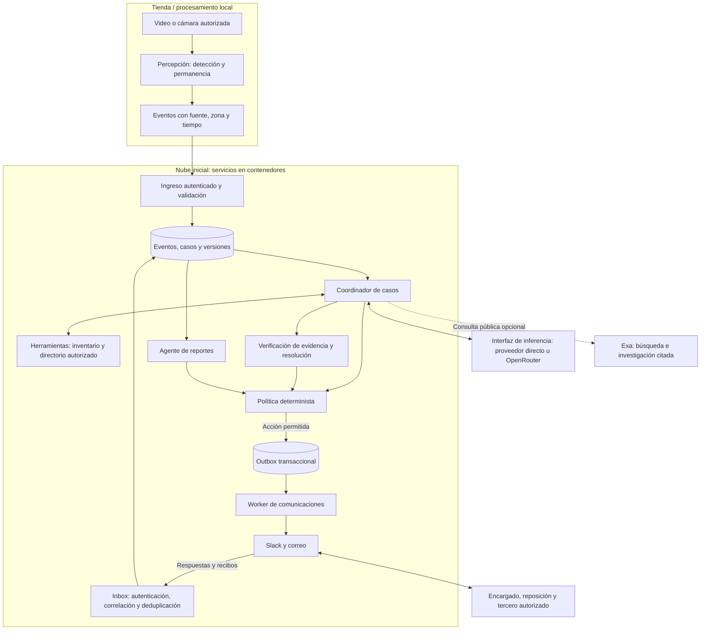
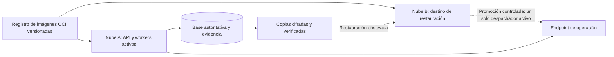

# Arquitectura objetivo de Panela Stocks

**Equipo:** PanelaTeam. **Verificación documental:** 12 de septiembre de 2026. **Estado:** diseño propuesto; no acredita infraestructura desplegada, cuentas conectadas ni D0 completado.

Panela Stocks gestionará casos desde una señal observable hasta su resolución, comunicándose autónomamente dentro de una política autorizada. Conserva visión local, estado persistente y controles deterministas; permite cambiar inferencia y nube sin delegarles autoridad sobre inventario, permisos o cierres.

## Flujo y responsabilidades

Percepción emite observaciones, sin convertir permanencia en faltante, compra o SKU. Cada evento conserva procedencia y configuración inmutables; el servidor registra su recepción. El coordinador consulta inventario vigente y responsables autorizados, solicita aclaraciones y propone la siguiente gestión. Una incidencia de exhibición y stock confirmados habilitan reposición; sin stock, consulta de entrega. Una fecha prometida no demuestra ejecución.

El agente de verificación contrasta evidencia con criterios de cierre. El de reportes resume hechos y pendientes en ambos canales, según destinatario. Un cierre humano no acredita verificación visual. **Los agentes son responsabilidades lógicas:** pueden compartir proceso y modelo; no requieren un contenedor por agente.

## Implementación actual y destino

La referencia del estado disponible es [server/README.md](../../server/README.md) y [U01](../../aidlc-docs/construction/U01-video-operations.md).

| Área | Disponible actualmente | Objetivo |
|---|---|---|
| Interfaz y estado | JavaScript/Vite, Node.js, SQLite local | API autenticada y almacenamiento transaccional con aislamiento por tienda |
| Visión | COCO-SSD y seguimiento en navegador; video histórico/local | Edge con cámaras autorizadas, calibración y evaluación anotada |
| Coordinación | Reglas; propuesta opcional acotada de Responses, sin prueba autenticada | Coordinador durable con herramientas, esperas, recordatorios y evaluación |
| Datos comerciales | Inventario ficticio y observación local | Inventario con fuente/fecha y directorio de roles verificados |
| Comunicaciones | Adaptadores salientes Slack/Resend; outbox; envío explícito restringido; cuentas pendientes | Slack/correo bidireccionales, inbox y despacho autónomo autorizado |
| Recuperación | Idempotencia/versiones; envío incierto conservado | Reconciliación, tareas programadas y reanudación tras fallos |
| Infraestructura | Ejecución local; sin plataforma multicloud desplegada | Contenedores portables y restauración comprobada |

## Autonomía y comunicaciones confiables

La política versionada determina tienda, identidad, rol, acciones, destinatarios, contenido compartible, vigencia, horarios y límites. Las acciones cubiertas se ejecutan sin aprobación repetida; ampliar facultades exige una persona autorizada. El modelo propone parámetros estructurados y el motor valida estado, evidencia y permisos antes de cada efecto. Comprar, pagar y cambiar precios siguen fuera del alcance D0.

La entrada valida autenticidad del canal y vincula remitente, tienda, hilo y caso con el directorio. Una firma válida del webhook no concede al remitente facultades adicionales. Correos, documentos y resultados web son datos no confiables: sus instrucciones no modifican política, herramientas ni destinatarios. Los contactos descubiertos en internet no ingresan automáticamente al directorio autorizado.

Casos, tareas y outbox se actualizan en una transacción con versión esperada. La inbox deduplica identificadores del proveedor; las operaciones usan claves estables por caso, versión, canal e intención. El worker distingue preparado, enviado/aceptado, entregado, respondido y resuelto. Ante timeout incierto reconcilia con el proveedor antes de reenviar; aceptación de API no equivale a entrega. Se limitan reintentos, recordatorios y escalaciones; se cancelan acciones obsoletas. No se promete entrega externa exactamente una vez.

## Proveedores intercambiables

**OpenRouter** es candidato para enrutar inferencia entre modelos/proveedores mediante una API compatible con Chat Completions de OpenAI. Se propone una interfaz interna que normalice propuesta, uso, latencia y errores; cambiar la URL no garantiza paridad con todas las funciones de Responses. Cada adaptador debe superar pruebas de contrato y comportamiento. [Documentación oficial](https://openrouter.ai/docs/faq).

El enrutamiento fijará modelos/proveedores admitidos, parámetros, presupuesto y timeout. Los fallbacks conservarán esa selección; sin alternativa elegible, el caso espera reintento o intervención. OpenRouter ofrece `allow_fallbacks`, `require_parameters`, `data_collection` y `zdr`; configurarlos según política, sin ampliar el tratamiento de datos durante un fallback. [Provider Routing](https://openrouter.ai/docs/guides/routing/provider-selection).

Se enviarán hechos mínimos, sin video ni rostros. Revisar retención y condiciones de cada endpoint y de la cuenta antes de habilitarlo: OpenRouter conserva metadatos de uso y contempla opciones de registro de contenido. ZDR no sustituye esa revisión ni la minimización. [Data Collection](https://openrouter.ai/docs/guides/privacy/data-collection).

**Exa** tendrá el papel de herramienta web opcional, no de pasarela general de inferencia equivalente a OpenRouter. Sus APIs ofrecen búsqueda, extracción y respuestas sustentadas; Agent ofrece investigación asíncrona en beta. Guardar URL, fecha y fragmento de respaldo, distinguiendo resultado generado de fuente original. No utilizarlo como verdad de inventario, autorización de contactos ni procesador de rostros; consultas operativas pueden prescindir de él. [Search](https://exa.ai/docs/reference/search), [Answer](https://exa.ai/docs/reference/answer) y [Agent](https://exa.ai/docs/reference/agent-api/overview).

## Contenedores y evolución multicloud

Se propone empaquetar API y workers como imágenes OCI, separando configuración y datos persistentes. OCI estandariza imagen, ejecución y distribución; la portabilidad de datos, identidad y servicios administrados requiere pruebas adicionales. [Open Container Initiative](https://opencontainers.org/about/overview/).

El primer despliegue usará una nube, una base autoritativa y almacenamiento persistente con copias restaurables. Para varios workers, migrar desde SQLite a una base transaccional de servidor; no compartir su archivo entre nubes. Separar visión edge cuando lo exijan cámaras o aceleración. Secretos de nube, modelos y canales permanecen en servidor, mediante almacén de secretos e identidades de servicio; nunca en imágenes, repositorio o bundle del navegador.

La nube A y la nube B son destinos intercambiables, no proveedores ya contratados. Las mismas imágenes alojan API y workers; infraestructura como código, configuración de identidad, red y persistencia se adapta a cada nube. La promoción del destino restaurado requiere detener o bloquear el despacho anterior para evitar efectos duplicados.

Kubernetes y operación activa en varias nubes requieren necesidad medida. Primero probar restauración en una segunda nube, sin dos despachadores activos para la misma operación.

## Entrega y evaluación

- **U02:** conectar cuentas de prueba, autenticar roles, implementar inbox/worker y demostrar conversación y reportes reales por Slack y correo, incluyendo fallo recuperable.
- **Piloto posterior:** validar cámaras, zonas, inventario, responsables y criterios de cierre; evaluar contra casos anotados y reglas base.
- **Portabilidad:** verificar contenedores, restauración y cambio de proveedor antes de ampliar despliegues.

Registrar por caso costo de inferencia/búsqueda, tokens, llamadas, reintentos, latencia por etapa, tiempos de respuesta humana, falsos casos, duplicados e intervenciones. Definir límites de gasto y objetivos de servicio con mediciones del piloto; todavía no hay estimaciones validadas de ahorro, precisión, capacidad o ROI.
