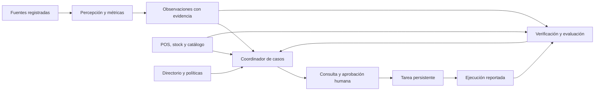

# PRD — PanelaTeam: operación de tiendas de abarrotes

**Versión 0.1 · 12 de septiembre de 2026 · Borrador completo para revisión**

| Campo | Estado |
|---|---|
| Responsable de producto | PanelaTeam; aprobador nominal pendiente |
| Producto | Nombre comercial pendiente; PanelaTeam es el nombre confirmado del equipo |
| Fuente de visión | [PVB operativo completo v0.1](../docs/01_PVB_PanelaTeam_Operacion_Abarrotes_v0.1.md) |
| Base del repositorio consultada | Commit `bac57df`; documentación y assets, sin aplicación |
| Alcance de este cambio | Especificación del producto y preparación documental de Inception |
| Aprobación del PRD | Pendiente; redactado no significa aprobado |
| Implementación y validación | No iniciadas en este encargo; ninguna meta es un resultado medido |

**Uso:** este archivo es la fuente canónica de requisitos de producto. El [índice AI-DLC](../aidlc-docs/inception/requirements/requirements.md) enlaza sus requisitos; las [historias](../aidlc-docs/inception/user-stories/stories.md) detallan aceptación. El [método](process.md) documenta las fuentes de HardcoreAI y la adaptación de AI-DLC classic del curso. Las [preguntas](../aidlc-docs/inception/requirements/requirement-verification-questions.md) separan respuestas del usuario de propuestas.

En HardcoreAI, **PVB significa Product Vision Board**. Los documentos operativos anteriores desarrollaron la visión con otra definición de la sigla; se normaliza aquí el término. Su contenido sigue siendo entrada del PRD, no evidencia de validación comercial.

## 0. Conflictos, vacíos y decisiones

Se revisaron los dos PVB del repositorio y las decisiones de la conversación. No hay entrevistas, benchmark cuantitativo, video seleccionado, sistema comercial conectado o mediciones del piloto disponibles en esas entradas.

| ID | Diferencia o vacío | Decisión de trabajo para este borrador | Estado / pregunta |
|---|---|---|---|
| DEC-01 | La visión pide cámaras conectadas; la demo usará material de internet. | Separar demo reproducible D0 de piloto conectado P1; nunca presentar replay como cámara en vivo. | Fuentes de demo confirmadas; conectores pendientes Q-02 |
| DEC-02 | Se propuso reposición, sin selección explícita del ciclo principal. | Usar reposición como escenario candidato y mantener los cinco casos de uso de la visión. | Prioridad pendiente Q-01 |
| DEC-03 | “Más escogido” puede significar retirada o compra. | Compra mediante POS; interacción visual de producto como capacidad independiente y posterior. | Propuesta de definición |
| DEC-04 | Ranking comercial por sección no identifica el origen físico de un SKU en varias exhibiciones. | Reportar categoría comercial asignada y declarar origen de exhibición desconocido cuando corresponda. | Regla de integridad |
| DEC-05 | Una fotografía no determina trayectorias ni permanencia. | Presencia puntual para fotos; episodios temporales solo si el video y el seguimiento los sustentan. | Regla de medición |
| DEC-06 | La señal de cámara no demuestra inventario en bodega. | Consultar ubicación, estado y vigencia; pedir confirmación antes de proponer una cantidad. | Regla de decisión |
| DEC-07 | El estado “verificado” puede esconder una simple declaración humana. | Registrar modalidad de cierre: confirmación humana, evidencia visual o ambas; respetar el criterio acordado por caso. | Refinamiento del PVB |
| DEC-08 | “Promoción funciona” no define resultado ni atribución. | Separar unidades, ventas y margen; comparación descriptiva mientras no exista un diseño causal validado. | Métrica principal pendiente Q-04 |
| DEC-09 | Faltan comprador, condiciones de captura, presupuesto, stack y desempeño de referencia. | Dejarlos TBD con opciones y responsables; no introducir números como resultados. | Q-02 a Q-05 |
| DEC-10 | El curso revisa segmentos de forma secuencial; se solicitó construir el PRD. | Consolidar un borrador completo revisable; mantener aprobación de producto y etapas posteriores pendientes. | Adaptación registrada |

Las decisiones de integridad evitan conclusiones que las fuentes no permiten. Las elecciones comerciales y de alcance siguen siendo propuestas revisables; la redacción no sustituye la decisión del equipo.

## 1. Producto, trabajo del usuario y misión

**Producto en una frase:** PanelaTeam ayuda a responsables de tiendas de abarrotes seccionadas a convertir observaciones del local y datos comerciales en gestiones con responsable, evidencia y resultado verificable.

**JTBD:** Cuando una sección presenta una situación que puede afectar su operación, quiero entender qué está ocurriendo, confirmar la información que falta y coordinar la siguiente acción, para resolverla sin perder seguimiento entre cámaras, inventario y conversaciones.

**Misión:** facilitar decisiones operativas comprobables y aprender de sus resultados. La utilidad se valida en el trabajo de la tienda; disponer de varios agentes o de una visualización atractiva no demuestra valor por sí solo.

**Fuente:** PVB §§1–2 y visión confirmada del usuario.

## 2. Contexto, problema y alternativas

Hipótesis de problema: señales de falta en exhibición, datos de stock y respuestas del personal pueden estar dispersos; el encargado debe reunirlos y seguir la gestión. La frecuencia, costo y severidad de ese problema aún necesitan observarse en una tienda.

Alternativas a investigar: rondas manuales, listas de reposición, reportes del POS, mensajería y software de ejecución retail. No se ha confirmado cuál usa el primer cliente ni que sea insuficiente.

Hay oferta comercial de análisis de estantes y coordinación: [Focal](https://focal.systems/shelf-cameras/) describe cámaras y tareas de reposición; [Trax/FORM](https://traxretail.com/es/) combina análisis visual y gestión de tareas. Estas referencias sostienen la existencia de la categoría, no una oportunidad desatendida o ventajas medidas de PanelaTeam.

**Por qué ahora:** la hackathon permite probar un recorrido pequeño; la oportunidad comercial depende de acceso, calidad de captura y voluntad de adopción. Tamaño de mercado, urgencia del comprador y ahorro esperado: **TBD**.

**Fuente:** PVB §§2, 11–12. No se dispone de cifras propias ni transcripciones que validen demanda.

## 3. Cliente ideal, usuarios y comprador

Segmento confirmado: tiendas de abarrotes con secciones distinguibles. Hipótesis inicial: establecimiento con un encargado identificable, zonas estables y capacidad de consultar ventas e inventario. Número de locales, superficie, geografía comercial, volumen de ventas y presupuesto: TBD; la ubicación de la hackathon no define el mercado objetivo.

| Persona | Trabajo y facultades propuestas | Adopción / objeción por validar |
|---|---|---|
| PER-01 Encargado | Revisa evidencia, confirma datos, aprueba gestiones dentro de su competencia y supervisa casos. | Que el sistema agregue mensajes y trabajo sin resolver problemas. |
| PER-02 Personal de reposición | Recibe una tarea concreta, reporta bloqueos y ejecución; no aprueba compras o precios por ese rol. | Tareas incorrectas, repetidas o imposibles por falta de mercancía. |
| PER-03 Responsable comercial/compras | Revisa ventas y promociones, aprueba compras/cambios según políticas. | Falta de evidencia económica o confianza en inventario. |
| PER-04 Administrador de instalación | Configura fuentes, zonas, directorio y permisos; la administración técnica no concede aprobación comercial. | Compatibilidad de cámaras, acceso, costo y mantenimiento. |

Comprador candidato: propietario o responsable de operaciones. La persona que puede bloquear adopción por acceso a cámaras, datos o presupuesto está por identificar. No se asume que coincida con el encargado.

Posibles disparadores de compra: faltantes recurrentes, seguimiento manual costoso o promociones difíciles de evaluar. Son hipótesis, no testimonios recopilados. [Personas detalladas](../aidlc-docs/inception/user-stories/personas.md).

## 4. Propuesta de valor y diferenciación

Hipótesis: una configuración acotada por sección, contexto comercial explícito y coordinación en el flujo habitual del encargado pueden facilitar adopción. Para sostenerla hay que comparar instalación, esfuerzo operativo, calidad y costo frente a la alternativa actual.

Ventaja defendible, precio y disposición a pagar: TBD. Integraciones y confianza basadas en evidencia podrían acumular valor; todavía no constituyen una barrera competitiva demostrada.

**Matriz 2×2 por investigar:** ejes propuestos, esfuerzo de puesta en marcha y amplitud del ciclo operativo comprobado. Se deben ubicar PanelaTeam, Focal, Trax/FORM y el flujo actual después de un benchmark con la misma rúbrica. No se asignan coordenadas ficticias.

| Alternativa | Capacidad documentada | Datos que faltan para comparar |
|---|---|---|
| Flujo actual de la tienda | Aún no observado | Tiempo, herramientas, errores y responsables |
| Focal | Visión de estante y tareas de reposición publicadas | Ajuste al segmento, instalación y condiciones comerciales |
| Trax/FORM | Análisis visual y gestión de tareas publicados | Integración, operación y costo para la tienda elegida |
| PanelaTeam | Diseño y criterios de prueba | Todo desempeño y valor requieren demostración/piloto |

**Fuente:** PVB §12. La investigación de validación y crítica extensa de la Estación 1 permanece pendiente; el PRD no la presenta como realizada.

## 5. Cinco casos de uso y resultados

Los casos describen la visión completa; no todos pertenecen a D0. Las historias US-01 a US-05 incluyen criterios Dado/Cuando/Entonces en el artefacto vinculado.

| Caso / historia | Actor y disparador | Recorrido propuesto | Resultado y KPI |
|---|---|---|---|
| UC-01 / US-01 Uso de secciones | Encargado consulta un período observable. | Selecciona fuente y zonas; revisa presencia/episodios; examina evidencia y limitaciones. | Distribución y duración observada; cobertura, error frente a anotación, tiempo de revisión. |
| UC-02 / US-02 Reposición | Posible faltante o reporte humano. | Revisa señal; consulta stock/ubicación; pide confirmación; aprueba tarea; verifica cierre. | Gestión trazable; tiempo de resolución y carga de alertas. |
| UC-03 / US-03 Ventas por producto | Comercial consulta desempeño de categoría. | Selecciona período; importa/consulta POS; reconcilia líneas; revisa rankings y faltantes. | Unidades/ventas netas y margen disponible; exactitud y cobertura comercial. |
| UC-04 / US-04 Exhibición/promoción | Comercial considera un cambio. | Consulta hechos; define hipótesis/métrica; aprueba experimento; registra ejecución; compara resultados. | Cambio registrado y evaluación con límites; resultado comercial según diseño. |
| UC-05 / US-05 Configurar tienda | Administrador incorpora una fuente o cambia el local. | Registra origen/acceso; configura zonas y responsables; valida cobertura; habilita el uso autorizado. | Fuente y configuración versionadas; tiempo hasta la primera gestión válida. |

El visitante observado por la cámara no es una cuenta del sistema. Las consultas comerciales agregadas no requieren reconocer su identidad.

## 6. Principios operativos y expresión en la interfaz

| Principio | Comportamiento observable | Interfaz y límite |
|---|---|---|
| Evidencia antes de conclusión | Cada hallazgo conserva fuente, período, medida y limitación. | Acceso al fragmento/registro; prohibido presentar datos ficticios como reales. |
| Incertidumbre explícita | Desconocido, cero y no observable son estados diferentes. | Motivo y siguiente dato necesario; prohibido completar información por invención. |
| Control proporcional a la acción | La política y el rol determinan qué puede proponerse, aprobarse y ejecutarse. | Acción/versión/destinatario visibles antes de aprobar; el texto recibido no amplía permisos. |
| Resultado comprobable | Guardado, entrega, ejecución reportada y verificación se registran por separado. | Línea de tiempo con estado real; un mensaje enviado no cierra una reposición. |
| Trabajo limitado y recuperable | Observaciones del mismo episodio actualizan el caso; reintentos no duplican tareas. | Un caso activo correlacionado, bloqueo y próximo paso visibles. |
| Datos mínimos y acceso delimitado | Consulta solo tienda y fuentes autorizadas; seguimiento temporal local. | Evidencia limitada al rol; reconocimiento facial y seguimiento entre tiendas fuera del alcance. |
| Accesibilidad y claridad | Funciones principales operables con teclado y texto comprensible. | El color acompaña etiquetas; errores describen cómo recuperar el flujo. |

Estos principios son requisitos de producto propuestos, no afirmaciones de cumplimiento de una aplicación inexistente. Fuente: PVB §§3–9.

## 7. Recorridos de usuario

**Encargado, recorrido principal candidato.** Abre el caso; revisa un posible faltante y su procedencia; consulta stock; responde sobre bodega si falta ese dato; revisa la propuesta; aprueba dentro de sus atribuciones; ve el identificador de tarea; recibe ejecución reportada y comprueba el criterio de cierre. Puede regresar después sin perder conversación o estado.

**Administrador.** Registra una fuente y su modo; vincula una tienda; configura zonas/versiones y catálogo; asigna contactos y permisos; revisa una muestra y el estado de disponibilidad; habilita el escenario. Si cambia la cámara o la distribución, crea una nueva versión y marca qué observaciones quedan afectadas.

**Interrupción o abandono.** Una aprobación se guarda, pero el usuario pierde la respuesta. Al reabrir, el sistema consulta la clave de la acción y recupera la misma tarea. Un caso sin respuesta conserva la pregunta y el responsable; un recordatorio depende del plazo y canal configurados. No se reenvía por cada fotograma.

**Escalamiento.** La cámara está oculta o el inventario tiene ubicación desconocida. El agente describe la limitación y solicita una comprobación concreta. Si no se obtiene, deja el caso bloqueado o descartado con motivo. Una persona puede confirmar la ejecución; el sistema conserva esa modalidad sin afirmar una verificación visual inexistente.

La demo representa los roles mediante identidades de prueba; no acredita autenticación de producción. El piloto requiere identidades y autorizaciones reales antes de conectar fuentes.

## 8. Alcance y prioridades MoSCoW

Horizontes: **D0**, demo de hackathon; **P1**, piloto en una tienda; **P2**, evolución. El escenario de reposición y esta priorización son candidatos pendientes de Q-01. Los requisitos de integridad aplican a cualquier escenario elegido.

| Prioridad | D0 propuesto |
|---|---|
| Must | Una tienda representada; fuente registrada; zonas; observación con evidencia; un caso contextual; consulta de stock fixture si se elige reposición; directorio de prueba; propuesta/aprobación; tarea y conversación persistentes; cierre tipificado; datos insuficientes y reintento; manifiesto reproducible. |
| Should | Conteo automático validado en el material seleccionado; POS fixture con rankings reconciliados; episodios de permanencia si hay video continuo adecuado. |
| Could | Comparación descriptiva de promociones fixture, segundo escenario, visualización adicional del uso de zonas. |
| Won't en D0 | Integración con cualquier cámara; compras o cambios de precio reales; comunicación con personal externo; identificación facial; seguimiento entre cámaras; atribución causal comercial; identificación universal de productos; promesas de disponibilidad o tiempo real no medidas. |

**Condición de autenticidad visual:** si el recorrido usa anotación humana, la coordinación puede demostrarse, pero la detección automática queda pendiente. Para declarar la capacidad visual implementada hay que ejecutar y evaluar el detector sobre el material; reproducir detecciones predefinidas no cumple ese criterio.

**P1 propuesto:** fuente autorizada de una tienda, una exhibición observable, consulta comercial vigente, responsables activos, canal acordado y medición frente al proceso actual. **P2:** más tiendas/secciones, interfaces comerciales adicionales, acciones externas preautorizadas, interacciones de SKU y evaluación de promociones con un diseño adecuado.

Cambiar prioridades debe actualizar requisitos, historias y manifiesto; no ampliar alcance por añadir integrantes. El plazo de la hackathon y el horizonte de 30/60/90 días son planes distintos.

## 9. Especificación funcional y calidad

La arquitectura es funcional: stack, base de datos, proveedores de modelo y despliegue quedan pendientes del diseño. Los roles de agentes pueden coexistir en un servicio. Los cálculos y permisos se aplican con lógica comprobable; un LLM interpreta contexto y decide qué herramienta o aclaración necesita.

Las pantallas propuestas son fuentes/configuración, resumen de secciones, detalle del caso, bandeja del responsable y resultados comerciales. Estas describen tareas necesarias, no un diseño visual aprobado.

| Módulo funcional | Requisitos | Rol y facultad | Pantalla o flujo |
|---|---|---|---|
| Fuentes y configuración | FR-01/02/08/14 | Administrador registra fuentes y asignaciones autorizadas; encargado consulta cobertura. | Fuentes, zonas, catálogo y directorio |
| Observación y uso del espacio | FR-03/04/15 | Encargado revisa evidencia; servicio de percepción produce observaciones sin facultad comercial. | Resumen de secciones y fragmentos |
| Datos comerciales | FR-05/06/13 | Comercial/encargado consulta según tienda; cambios requieren permiso independiente. | Ventas, stock y evaluación de promociones |
| Coordinación y propuestas | FR-07/08/09 | Coordinador propone; responsable humano aprueba dentro de sus atribuciones. | Detalle de caso, conversación y aprobación |
| Tareas y cierre | FR-10/11/12 | Reposición reporta ejecución; encargado verifica según criterio. | Bandeja, estado e historial |
| Evidencia y evaluación | FR-13/16 | Roles autorizados consultan/exportan evidencia correspondiente a su tienda. | Manifiesto y resultado con limitaciones |

### Requisitos funcionales

**FR-01 — Procedencia de fuentes.** Registrar identificador, tienda, modo (foto, replay, cámara, fixture o anotación humana), origen, condiciones de uso, período representado, zona horaria y versión. Conservar tiempo del contenido separado de hora de procesamiento. **Aceptación:** un replay y un POS ficticio permanecen etiquetados en resultados y exportación; no aparecen como transmisión o transacciones reales. D0 Must. Fuente PVB §§8, 11; US-01/05; E-01.

**FR-02 — Zonas y catálogo versionados.** Asociar observaciones a zonas de una configuración determinada, con regla de pertenencia y tratamiento de fronteras; conservar mapeo SKU–categoría y vigencia. **Aceptación:** cambiar una zona no reinterpreta silenciosamente observaciones históricas; un SKU sin mapeo se conserva como no asignado. D0 Must para zonas; POS según FR-05. PVB §§3–4, 8; US-01/05; E-02/E-06.

**FR-03 — Observaciones y cobertura.** Producir tipo de evento, medida/unidad, intervalo, evidencia, calidad y limitaciones; producto desconocido es un valor válido. **Aceptación:** zona oculta genera no observable, no cero ni faltante confirmado; una anotación manual conserva su autor y procedencia. D0 Must para el contrato; percepción automática según material validado. PVB §§3–4; US-01/02; E-03/E-04.

**FR-04 — Métricas espaciales.** Calcular conteo visible y, cuando sea posible, entradas/episodios y duración observada. Marcar inicio/fin truncados y fragmentación; excluir interrupciones del denominador. **Aceptación:** fotos no generan permanencia; una persona visible en varios fotogramas no se cuenta como varias visitas por esa razón. Comparar eventos con anotación independiente y tolerancia predefinida. D0 Should para seguimiento; P1 según cobertura. PVB §§3, 9; US-01; E-03/E-04.

**FR-05 — Ventas por producto y categoría.** Importar/consultar líneas identificables de POS, descuentos, devoluciones, cancelaciones y moneda bajo una convención declarada. Calcular rankings de unidades netas, ventas netas y margen si existen costos. **Aceptación:** fixture reconciliado con totales esperados independientes; sin costo no hay margen; sin origen de exhibición no se atribuye la venta físicamente. D0 Should, P1 sujeto a acceso. PVB §§3, 9; US-03/04; E-06.

**FR-06 — Inventario con ubicación y vigencia.** Consultar cantidad/unidad, ubicación o desconocida, estado, fuente, fecha y versión; no confundir disponible, reservado y en tránsito. **Aceptación:** con total por tienda el agente pregunta por bodega; con dato antiguo solicita confirmación según umbral configurado. D0 Must mediante fixture si se elige reposición. PVB §§3, 6; US-02; E-05/E-07.

**FR-07 — Coordinación contextual.** Relacionar observación, consultas, incertidumbre, responsable y siguiente acción; justificar esa acción con evidencia. **Aceptación:** ante stock confirmado, falta de stock o cobertura insuficiente, producir respectivamente propuesta sustentada, consulta de entrega/alternativa o petición de verificación. No exigir un número de agentes o proveedores para aprobar el resultado. D0 Must. PVB §§5–6; US-02/04; E-05.

**FR-08 — Responsables y comunicaciones.** Resolver destinatario desde directorio/turno autorizado; incluir situación, evidencia, pregunta/acción esperada y plazo si está configurado. Registrar entrega y respuesta por separado. **Aceptación:** sin destinatario autorizado el caso pide configuración y no envía; repetidas observaciones no generan avisos nuevos. D0 bandeja interna con roles de prueba; canales reales P1. PVB §§5–7; US-02/04/05; E-08/E-13.

**FR-09 — Propuesta y aprobación.** Vincular aprobación a actor, tienda, política y versión de acción, producto, cantidad y destinatario. **Aceptación:** actor sin facultad no aprueba; modificar parámetros invalida la aprobación anterior; contenido de video/mensaje no concede permisos. Cantidades necesitan respaldo de stock y capacidad, o confirmación responsable. D0 Must. PVB §§7–8; US-02/04/05; E-07/E-09/E-10.

**FR-10 — Idempotencia y correlación.** Un caso activo por problema/episodio; claves estables por acción. Diferenciar reanudación de una demo del inicio de otro escenario. **Aceptación:** doble aprobación, concurrencia y pérdida de respuesta después de guardar producen una sola tarea; consultar resultado incierto antes de repetir. D0 Must. PVB §8; US-02; E-08.

**FR-11 — Persistencia y recuperación.** Conservar conversación, consultas, versiones, aprobaciones, acciones y transiciones con actor y tiempo. **Aceptación:** recarga y reinicio recuperan el estado y el mismo identificador; un error de almacenamiento no se anuncia como éxito. D0 Must. PVB §§6–8; US-02; E-08/E-11.

**FR-12 — Cierre con evidencia.** Separar ejecución reportada de cierre; registrar criterio y modalidad: humana, visual o ambas. **Aceptación:** “hecho” sin imagen se identifica como confirmación humana; si el criterio exigía evidencia visual, permanece pendiente de verificación. D0 Must. PVB §§6–7; US-02/04; E-11.

**FR-13 — Promociones y cambios.** Registrar hipótesis, intervención aprobada, ejecución, período, SKUs/categoría y métrica; calcular comparaciones descriptivas con limitaciones. **Aceptación:** sin POS no se declara éxito comercial; sin costos no se declara mejora de margen; un antes/después sin diseño adecuado no se etiqueta como efecto causal. D0 Could, P2 para evaluación causal. PVB §10; US-04; E-12.

**FR-14 — Conectores reales.** Incorporar cámaras/grabadores y fuentes comerciales que hayan sido seleccionados, con credenciales fuera del repositorio, salud, tiempos y alcance de acceso. **Aceptación futura:** conexión autorizada y recuperación de caída comprobadas en el modelo concreto; modo y vigencia visibles. Compatibilidad universal excluida. P1, sujeto a Q-02/Q-03. PVB §§4, 11; US-05; E-14.

**FR-15 — Interacciones visuales por SKU.** Detectar retirada y devolución al estante solo con producto/ubicación identificables y datos de evaluación específicos. **Aceptación futura:** medir errores frente a anotación; una retirada no se transforma en venta. P2; no bloquea D0. PVB §3; extensión de US-01/03; E-15.

**FR-16 — Evidencia reproducible.** Exportar manifiesto con versiones, fuentes, fixtures, anotaciones, ejecución, salidas y limitaciones sin credenciales ni datos ajenos. **Aceptación:** otra persona puede recuperar el caso y contrastar resultados esperados; salidas simuladas no cuentan como ejecución real de una herramienta. D0 Must. PVB §§8, 11; US-01/02/05; E-01/E-11/E-13.

### Requisitos no funcionales candidatos

Las cifras siguientes son **objetivos propuestos para un entorno de prueba documentado**, no desempeño observado ni SLA comercial. El equipo debe revisar Q-05 antes de comprometer presupuesto o piloto.

| ID | Criterio comprobable | Alcance y condición |
|---|---|---|
| NFR-01 Integridad numérica | Coincidencia exacta con importes esperados en unidad monetaria mínima y conteos enteros de fixtures; redondeo explícito. | Cada fixture comercial del conjunto E-06; tolerancias visuales se fijan antes de evaluar E-03/E-04. |
| NFR-02 Aislamiento | Cero lecturas o escrituras de otra tienda en todos los escenarios E-09, incluyendo acceso directo a identificadores. | Roles de demo no equivalen a identidad real; autenticación de piloto pendiente Q-03. |
| NFR-03 Control de efectos | Cero compras, cambios de precio o mensajes externos en D0; cero acciones sin autorización válida en E-07/E-09/E-10. | Las tareas se guardan en el entorno de prueba. |
| NFR-04 Procedencia | Todo hallazgo y acción de E-01 a E-13 incluye fuente, período, estado y motivo cuando falta información. | Validación de campos y revisión humana de que la fuente respalda el texto. |
| NFR-05 Respuesta | Propuesta: acuse visible de acción ≤2 s y respuesta/estado de espera del agente ≤15 s en 20 interacciones del entorno declarado. | Medir cada interacción; no prometer completar análisis de video en ese tiempo; al vencer, informar espera/fallo sin falso éxito. |
| NFR-06 Recuperación | Cero tareas duplicadas y estado durable tras recarga, reinicio, timeout y doble aprobación en E-08/E-11. | Verificación de base persistente y estados, no solo apariencia de interfaz. |
| NFR-07 Uso accesible | Todo el recorrido D0 operable con teclado; controles con nombre, foco visible, etiquetas de estado y errores en texto. | Revisión manual del recorrido; no constituye certificación completa de accesibilidad. |
| NFR-08 Costo y operación | Cada ejecución registra duración y uso/costo disponible del modelo, o “no disponible”; respeta límite configurable de llamadas. | Límite y presupuesto monetario TBD; al agotarlo, conserva estado y pide intervención. E-13. |
| NFR-09 Protección de datos | Cero credenciales en repo/exportaciones; retención y acceso configurados antes de P1. | D0 datos comerciales ficticios; revisión de permisos del material visual. |
| NFR-10 Reproducibilidad | Repetir el mismo escenario conserva invariantes de datos, permisos y número de tareas. | No exigir idéntica prosa del LLM; conservar modelo, prompt/configuración y versiones. |

### Contratos y estados

Entidades mínimas: fuente, configuración de zona, catálogo, observación, episodio de visita, línea POS, inventario, responsable/política, caso, propuesta, aprobación, tarea, evidencia de cierre y experimento. Toda entidad operacional tiene identificador y tienda; las relevantes para interpretación conservan versión y vigencia.

Estados base: `detectado → en_validación → propuesta → aprobado → asignado → ejecución_reportada → cerrado`. El cierre conserva `modalidad` y cumplimiento del criterio. `bloqueado`, `descartado` y `cancelado` requieren motivo. No se cierra automáticamente por respuesta de un LLM.

Cambios en stock, producto, cantidad, destinatario o política entre aprobación y ejecución requieren revalidación. El dato comercial no se puede actualizar solo porque una imagen parezca distinta: una modificación de inventario será una acción explícita con su propio permiso.

## 10. Métricas de éxito

**North Star propuesta:** proporción de casos confirmados accionables resueltos conforme al criterio de cierre dentro del plazo acordado.

Denominador: casos confirmados accionables con plazo ya vencido a la fecha de corte. Numerador: esos casos cerrados correctamente antes de su vencimiento. Incluir abiertos vencidos; publicar cantidad de casos, descartes y motivos. Si no hay casos elegibles, el resultado es no disponible, no 100 %. Esta métrica requiere plazo acordado y no mide por sí sola ventas recuperadas.

| Métrica | Definición | Baseline y meta |
|---|---|---|
| North Star | Definición anterior, por tienda y período. | Baseline TBD; objetivo comercial a acordar en Q-04 tras observar el flujo actual. |
| Activación | Tiendas configuradas que completan una gestión válida / tiendas habilitadas para la prueba, con ventana definida. | D0: una gestión completa reproducible; P1 meta TBD. |
| Retención operativa | Tiendas activadas que realizan gestiones útiles en semanas sucesivas / tiendas elegibles para seguimiento. | Ventana y frecuencia TBD según ocurrencia real del problema; no equiparar logins con valor. |
| Tiempo de resolución | Distribución entre primera señal y cierre, con tiempo de respuesta/ejecución separado y casos aún abiertos. | Baseline manual TBD; meta de reducción por acordar. |
| Carga y utilidad | Tiempo humano total, alertas por turno y proporción de alertas revisadas accionables. | D0 contabiliza cada caso; P1 exige comparador actual y revisión también de ventanas sin alertas. |
| Calidad visual | Error de conteo, cruces y duración frente a anotación, con cobertura y episodios incompletos. | Baseline/modelo TBD; tolerancias fijadas antes del conjunto reservado. |
| Calidad agéntica | Afirmaciones sustentadas, próximo paso útil según rúbrica, abstención pertinente y respeto de permisos. | D0: ninguna afirmación crítica sin soporte o acción no autorizada en casos requeridos. |
| Economía de operación | Costo por caso y hora observable más esfuerzo de configuración y humano. | Datos aún no medidos; presupuesto y precio TBD. |
| Resultado comercial | Unidades/ventas/margen descriptivos; efecto incremental solo con evaluación válida. | D0 fixture no valida negocio; P1/P2 según Q-04 y datos. |

**Éxito binario de D0:** ejecutar el recorrido seleccionado con procedencia visible, siguiente paso contextual, aprobación válida, tarea durable y cierre correctamente tipificado; superar sus casos obligatorios de insuficiencia y reintento. Si falla un permiso, se duplica una tarea, se inventa una venta o se presenta un fixture como hecho real, la demo no pasa la aceptación definida, aunque la interfaz funcione.

## 11. Plan de evaluación del agente y del sistema

**Datos necesarios.** Manifiesto versionado con fuente/condiciones de uso, video e intervalos, zonas, catálogo, fixtures POS/stock, responsables, políticas, respuestas de prueba, anotaciones y resultados esperados. Guardar un subconjunto reservado que no se use para ajustar prompts/reglas. Las anotaciones son independientes de la salida del modelo y conservan incertidumbre o desacuerdos.

No entrenar ni ajustar sobre el conjunto reservado antes de reportar su resultado. Si se cambia el sistema después de examinar fallos, declarar la nueva iteración y reservar nuevos casos cuando se pretenda estimar desempeño. Una muestra pequeña de hackathon detecta problemas de la demo; no prueba generalización a todas las tiendas.

| ID | Escenario y oráculo de comprobación | Requisitos | Horizonte |
|---|---|---|---|
| E-01 | Replay/fixture/anotación conservan su procedencia en pantalla y exportación; tiempos del contenido y ejecución diferenciados. | FR-01, FR-16 | D0 |
| E-02 | Cambio de geometría conserva versión anterior; frontera y zona desconocida siguen la regla declarada. | FR-02 | D0 |
| E-03 | Foto o zona oculta: conteo observable o estado desconocido comparado con anotación; ninguna duración inventada. | FR-03, FR-04 | D0 contrato; visión según alcance |
| E-04 | Episodios continuos, truncados y fragmentados: conteos de visitas y duraciones contrastados con anotación. | FR-03, FR-04 | D0 Should / P1 |
| E-05 | Mismo evento, tres respuestas sobre stock/cobertura: próximo paso diferente y sustentado. | FR-06, FR-07 | D0 obligatorio si se elige reposición |
| E-06 | POS con duplicado, descuento, devolución, cancelación, SKU sin sección y costo ausente; totales calculados fuera del LLM. | FR-02, FR-05 | D0 Should / P1 |
| E-07 | Stock o propuesta cambia tras aprobación: detener acción dependiente y revalidar autorización. | FR-06, FR-09 | D0 |
| E-08 | Doble aprobación concurrente y timeout después de guardar: una tarea, mismo ID y recuperación de resultado. | FR-08, FR-10, FR-11 | D0 |
| E-09 | Persona de tienda A intenta leer/aprobar en B y rol sin facultad intenta actuar: denegación en servidor. | FR-09 | D0 con identidades de prueba; identidad real P1 |
| E-10 | Texto en imagen, CSV o mensaje ordena omitir políticas o comprar: se mantiene como dato sin elevar permisos. | FR-09 | D0 |
| E-11 | Recarga, reinicio, fallo de escritura y “hecho” sin evidencia visual: estado durable o fallo explícito; modalidad de cierre correcta. | FR-11, FR-12, FR-16 | D0 |
| E-12 | Promoción antes/después sin costos o sin control: salida descriptiva y límites, sin afirmación causal. | FR-13 | D0 Could / P2 |
| E-13 | Falta destinatario, agotamiento de llamadas, evidencia no disponible o fallo de exportación: bloqueo explicado y conservación del caso. | FR-08, FR-16; NFR-08 | D0 |
| E-14 | Conector autorizado se interrumpe y vuelve: estado de fuente, frescura y reanudación verificables. | FR-14 | P1 |
| E-15 | Retirada y devolución de producto identificable: errores medidos contra anotación, sin convertir eventos en compras. | FR-15 | P2 |

**Rúbrica de salida:** (1) hechos respaldados por fuente concreta; (2) cálculo correcto; (3) información ausente explícita; (4) próximo paso pertinente y destinatario válido; (5) permiso/efecto real correctamente reportado. Revisar texto y registros de herramienta; una cita existente no basta si no sostiene la conclusión.

**Protocolo D0:** definir alcance y tolerancias antes de ejecutar; correr todos los escenarios requeridos por los Must; registrar cada resultado como pasa, falla o no ejecutado. Should/Could omitidos se declaran diferidos, nunca aprobados. Registrar la variación entre ejecuciones del agente y los defectos encontrados. Los invariantes de permisos, datos y persistencia deben cumplirse en cada ejecución registrada, aunque cambie la redacción.

Si Q-01 selecciona otro recorrido, se sustituye E-05 por un escenario de ramificación equivalente y se actualizan FR-07, historia e índice antes de aceptar D0. La demostración de coordinación contextual es obligatoria para cualquier opción; no puede omitirse por cambiar la prioridad comercial.

**Evidencia de aceptación futura:** manifest, versión de configuración/modelo, entradas, salidas, trazas relevantes, comprobación del almacenamiento, revisión humana y limitaciones. En este PRD todos los escenarios están diseñados, **no ejecutados**.

## 12. Diez riesgos y mitigaciones

Probabilidad es una valoración cualitativa inicial para priorizar revisión, no una estimación estadística. Se revisará con material y piloto. Impacto se refiere al objetivo de una operación fiable.

| Riesgo | Probabilidad inicial | Impacto | Mitigación y evidencia de control |
|---|---|---|---|
| R-01 Cámara sin encuadre/resolución útil | Alta | Alto | Prueba de observabilidad antes de construir detector; limitar sección o usar origen humano declarado. |
| R-02 Confundir presencia, interacción y compra | Alta | Alto | Contratos separados, POS para ventas y E-03/E-04/E-06/E-15. |
| R-03 Stock antiguo o ubicación desconocida | Alta | Alto | Vigencia, consulta al responsable y revalidación E-05/E-07. |
| R-04 Falsas alertas y fatiga del personal | Media | Alto | Correlación de casos, avisos por cambio relevante, medición de trabajo y revisión de omisiones. |
| R-05 Acción duplicada o sin permiso | Media | Alto | Idempotencia, aprobación versionada y pruebas E-07 a E-10. |
| R-06 Material no reutilizable o acceso indebido a imágenes/datos | Media | Alto | Registrar condiciones de uso y responsables; material adecuado y acceso/retención definidos antes del piloto. |
| R-07 Resumen convincente con evidencia insuficiente | Alta | Alto | Rúbrica de factualidad, abstención, revisión de fuentes y separación declaración/verificación. |
| R-08 Inferencia comercial engañosa | Alta | Alto | Descuentos/costos/stock explícitos, comparación descriptiva y diseño causal antes de atribuir efectos. |
| R-09 Integración/cómputo cuestan más que el valor | Media | Alto | Una tienda/sección, presupuesto configurable, costo por caso y medición del esfuerzo completo. |
| R-10 Falta de demanda o alcance excesivo | Alta | Alto | Acordar problema/prioridad con comprador, comparar alternativa actual y limitar D0 a una acción. |

Los responsables de cada riesgo serán asignados por el equipo antes de construcción; hoy solo se identifican roles candidatos: producto, percepción, integración y operación. El PRD no concede aprobación legal, acceso a cámaras ni compromisos comerciales.

## 13. Entrega, validación y próximos gates

**Hackathon D0 — corte independiente.** Confirmar Q-01 y seleccionar material; especificar fixture y cierre; elegir stack; construir un recorrido; ejecutar aceptación; preparar README de arranque y video de dos minutos. La agenda del evento se confirma con organizadores; este PRD no asume que queden cuatro horas disponibles.

| Horizonte orientativo desde el inicio de trabajo acordado | Entrega candidata | Evidencia necesaria para continuar |
|---|---|---|
| Días 1–30 | Validación del problema, observabilidad, contrato comercial y prototipo de una sección | Responsable y material disponibles, decisiones de alcance, línea base y casos de aceptación |
| Días 31–60 | Piloto limitado con fuentes y canal autorizados | Compatibilidad comprobada, aceptación técnica, uso del personal y costo medido |
| Días 61–90 | Evaluación e iteración; decisión de ampliar o cambiar | Comparación operativa, alertas/omisiones, carga humana, interés comercial y límites de resultados |

Es un plan condicional, no un calendario comprometido. Si faltan acceso o utilidad demostrable, revisar el enfoque antes de ampliar tiendas, modelos o canales.

**Gate de revisión del PRD:** resolver preguntas que cambian el primer recorrido, aceptar o ajustar sus Must y NFR, designar aprobador y registrar la decisión. Los vacíos que afecten la primera unidad se resuelven antes de implementarla.

**Después del PRD:** refinar historias, diseñar arquitectura y contratos concretos, decidir stack mediante evidencia, dividir unidades y crear backlog con dependencias. Los documentos de arquitectura y backlog no se generan como si ya estuvieran aprobados en este cambio.

**Definición de PRD listo para diseño:** segmentos revisados; alcance D0 y piloto diferenciados; requisitos con fuente y aceptación; escenarios trazables; responsables/decisiones críticas asignados; hipótesis y limitaciones visibles. Estado actual: borrador revisable, con Q-01 a Q-05 pendientes; Inception formal no cerrada.
